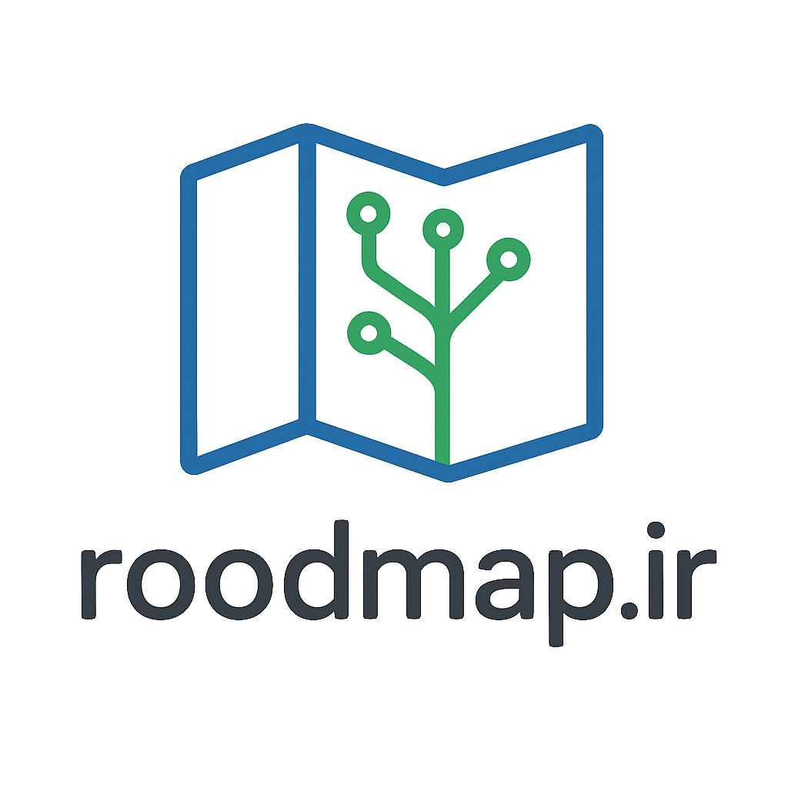

# roodmap.ir – نقشه راه یادگیری برنامه‌نویسی



> نقشه راه یادگیری برنامه‌نویسی به صورت فارسی. مسیر خودت را مرحله به مرحله دنبال کنید و مهارت‌های برنامه‌نویسی را به راحتی یاد بگیرید.

---

## 🎯 هدف پروژه

هدف این پروژه ایجاد یک **نسخه MVP از نقشه راه یادگیری برنامه‌نویسی به زبان فارسی** است.  
کاربران می‌توانند مسیرهای آموزشی را به صورت سلسله‌مراتبی مشاهده کنند و مراحل یادگیری را مرحله به مرحله دنبال کنند.

---

## 🧩 MVP – امکانات نسخه اولیه

نسخه اولیه شامل امکانات زیر است:

1. **صفحه اصلی (Home)**
    - نمایش roadmap انتخابی (مثلاً Frontend)
    - عنوان و توضیح کلی هر مسیر

2. **Roadmap Node (کامپوننت اصلی)**
    - نمایش نودها به صورت تودرتو و سلسله‌مراتبی
    - امکان باز/بسته کردن هر نود برای نمایش جزئیات
    - توضیح کوتاه برای هر نود

3. **داده‌ها (JSON ساده)**
    - roadmap ها به صورت فایل JSON ذخیره شده‌اند
    - امکان گسترش با roadmap های جدید

4. **طراحی راست‌چین و فونت فارسی**
    - تجربه کاربری مناسب برای کاربران فارسی‌زبان

5. **هدر و فوتر ساده**
    - نام پروژه، شعار و لینک‌های مهم
    - فوتر با حقوق و attribution

---

## 🗂️ صفحات

- **صفحه اصلی (Home)** – `/`
- **نسخه MVP** – `/mvp` (نمایش roadmap ها)
- **GitHub / منابع آموزشی** – لینک مستقیم به مخزن پروژه

---

## 🚀 مراحل توسعه

### فاز 1 – نسخه اولیه (MVP)
- نمایش roadmap Frontend به صورت سلسله‌مراتبی
- هدر و فوتر ساده
- راست‌چین + فونت فارسی
- باز/بسته کردن نودها

### فاز 2 – توسعه و بهبود
- اضافه کردن roadmap های دیگر (Backend، Fullstack)
- قابلیت جستجو در نودها
- لینک منابع آموزشی برای هر نود
- ذخیره وضعیت باز/بسته بودن نودها
- حالت تاریک / روشن

### فاز 3 – تکمیلی (اختیاری)
- پنل مدیریت برای افزودن/ویرایش roadmap ها
- پشتیبانی از چند زبان
- بهینه‌سازی SEO و performance

---

## ⚡ تکنولوژی‌ها

- **Frontend:** Vue 3 + TailwindCSS + Nuxt 4
- **Backend:** Laravel (برای API و مدیریت داده‌ها)
- **داده‌ها:** JSON ساده برای MVP
- **Deployment:** Vercel یا Netlify (Frontend)

---

## 📦 نصب و اجرای MVP

```bash
# نصب وابستگی‌ها
npm install

# اجرای پروژه در لوکال
npm run dev
```

This Readme was generated by AI.